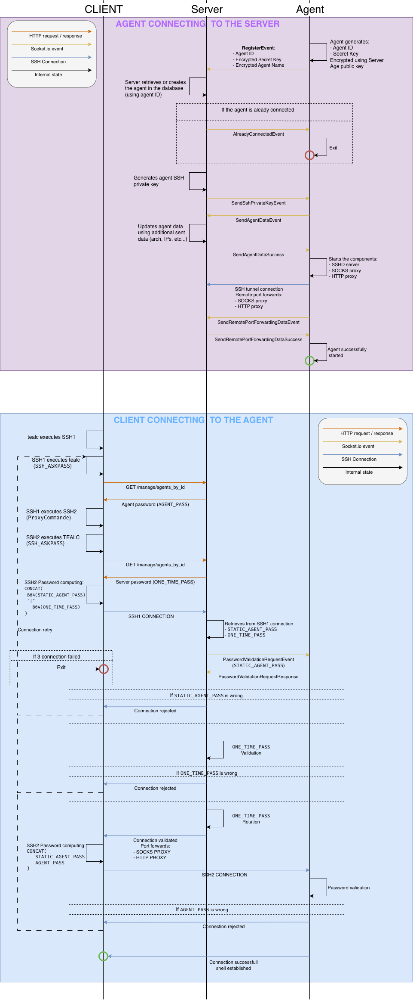

The agent separates orchestration (control) from operational traffic (data):
- **Control socket**: A Socket.IO component, which is used to transmit agent metadata and receive control instructions from the server (reset/kill, etc.)
- **Data socket**: An SSH channel used to tunnel operational traffic (proxies, SSH access, pivoting services, etc.). Depending on egress filtering restrictions, it may be encapsulated (see [agent/tunnels]()).

If a connection is lost, the agent automatically attempts to reconnect to both channels using an exponential backoff strategy.

The agent also sends periodic keepalive pings on both the data (SSH) socket and the control socket to detect broken connections promptly.

Configure the keepalive interval with `--keepalive` (default: `20` seconds). Set to `0` to disable keepalive pings entirely.

## Control socket

The control socket is a Socket.IO client/server.
It works on:
1. WebSocket (via HTTP Upgrade)
2. HTTP long polling
3. Encapsulated over DNS – in this mode, the WebSocket transport is tunneled through DNS queries and responses, allowing the control channel to operate in environments where only DNS egress is allowed.

All control messages are encrypted. The agent identifier is an exception: it is transmitted in cleartext so the server can associate the connection with the correct agent instance.

The initial message is encrypted using the server's `age` public key, which is embedded in the agent binary.
During this step, the agent generates and transmits a symmetric session key.
All subsequent control messages are encrypted using this symmetric key.

## Data socket

The data socket is an outbound SSH connection initiated by the agent to the server, allowing the connection to traverse NAT and restrictive firewalls.

This SSH connection may be encapsulated over tunnels (see [agent/tunnels]() and [server/services]())

Through SSH remote port forwarding, the agent exposes several services to the server, including:
- SSH access to the agent host
- SOCKS and HTTP proxy services
- A WireGuard endpoint for network pivoting

SSH authentication uses an ephemeral public key generated by the server for each agent connection.
