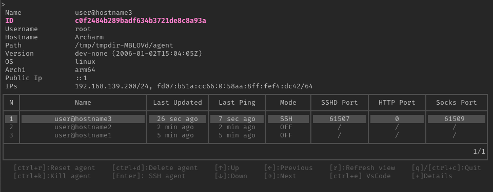

> Goauld is a post-exploitation and remote access tool designed for use in restricted environments.

During penetration tests, operators may be required to work from a client-provided laptop behind VPNs, authenticated egress proxies, or restrictive network controls. In other cases, gaining remote code execution on a system still requires establishing a stable and fully interactive access channel.

Goauld solves these problems by providing a tunneling and access framework that allows operators to interact with remote agents through multiple transport protocols while maintaining a secure SSH-based architecture.

This tool addresses these use cases.
It is composed of three components:
- The server, exposing an SSH server both directly and through multiple tunneling transports
- The agent, which embeds an SSH server, SOCKS and HTTP proxies 
- The client (**tealc**), which allows access to agents and interaction with them

## Use cases

- Post-exploitation remote access
- Working from restricted corporate assessment laptops
- Bypassing authenticated proxies
- Pivoting through compromised hosts

## Features

The main agent features are:
- SSH encapsulation over
    * Direct SSH
    * TLS
    * QUIC
    * Websocket
    * HTTP
    * DNS
- Support for egress proxies, and automatic NTLM/Kerberos authentication if required by the proxy
- Automatic NTLM/Kerberos applicative authentication if the targeted application requires it
- Exposes SOCKS and HTTP proxy (that can also go through HTTP proxies)
- Full-blown interactive shell
- Copy files via integrated SCP, Rsync or Rclone
- Tun interface using an integrated virtual WireGuard embedded in the agent
- Socket listening or binding on the agent
- Agent relaying

## Demo

<video width=90% controls autoplay>
    <source src="Demo.webm" type="video/webm">
    Your browser does not support the video tag.
</video>

The global architecture is based on an outbound SSH tunnel from the agent to the server.
All communications are encapsulated within this tunnel in order to prioritize security and network segmentation.
